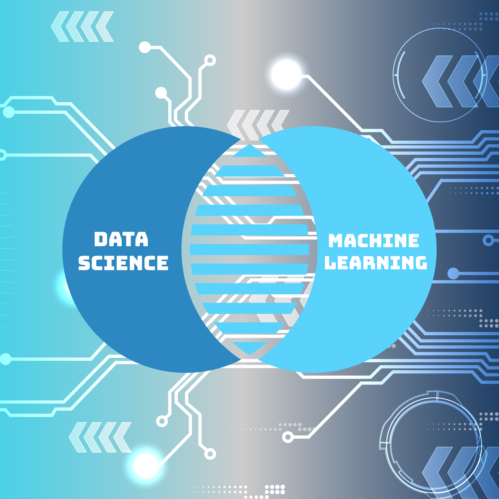

# INDE 577 - Data Science & Machine Learning 

## Final Project Fall 2023

### Student: Kiara A. Richardson

### Contact: kar15@rice.edu

### Instructor: Randy R. Davila

### Course and Project Description

This course covers the fundamentals of data science and machine learning. Topics include: introduction to scikit-learn, Keras and tensorflow2, linear and logistic regression, clustering, support vector machines, random forest trees, neural networks, deep learning, natural language processing. This repository contains 4 folders for my Final Project: Computational and Applied Mathematics Examples, Data Science Foundations, Supervised Learning, and Unsupervised Learning. Each folder contains Jupyter Notebooks that showcase the skills I learned throughout this semester-long course.   

**Computational and Applied Mathematics Examples**:
 * The Advanced Pendulum
 * Runge-Kutta Methods
 * Image Compression
 * Neural Network
 * L2 Projection
 * The Heat Equation
 * Lloyds Algorithm
 
**Data Science Foundations**:
 * Data Exploration and Visualization
 * Feature Engineering and Selection
 * Python Introduction
 * Statistical Inference and Hypothesis Testing

**Supervised Learning**:
 * Decision and Regression Trees
 * Gradient Descent
 * K-Nearest Neighbors
 * Linear and Logistic Regression
 * Neural Network
 * Single Neuron Model - The Perceptron

**Unsupervised Learning**:
 * K-Means Clustering
 * Principal Component Analysis (PCA)
