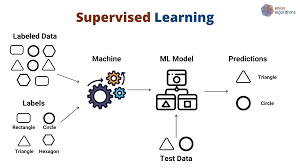

# Supervised Learning 

Supervised learning is a fundamental paradigm in machine learning where the algorithm learns from labeled training data to make predictions or decisions on unseen data. In this approach, the algorithm is provided with input-output pairs, and the goal is to learn a mapping function that can generalize well to new, unseen examples. Python, with its rich ecosystem of libraries, serves as a powerful tool for implementing and applying supervised learning algorithms. Libraries like scikit-learn provide a comprehensive set of tools for tasks such as classification, regression, and model evaluation. The workflow typically involves data preprocessing, feature engineering, and the selection of an appropriate model. Popular algorithms include decision trees, support vector machines, and neural networks, each catering to different types of problems. Cross-validation techniques and hyperparameter tuning are crucial for optimizing model performance. Python's readability and simplicity make it an ideal language for prototyping and experimenting with different algorithms. The integration of advanced techniques such as ensemble methods and deep learning further enhances the capabilities of supervised learning in Python, allowing practitioners to tackle a wide array of real-world problems with varying complexity. Continuous advancements in the Python ecosystem and active community support contribute to the versatility and effectiveness of supervised learning in addressing diverse challenges across industries.

This folder houses six Supervised Learning techniques I've aquired throughout this course. Fell free to browse around!